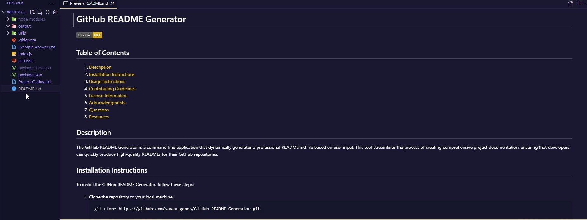

# GitHub README Generator

[](https://opensource.org/licenses/MIT)
       

## Table of Contents

1. [Description](#description)
2. [Installation Instructions](#installation-instructions)
3. [Usage Instructions](#usage-instructions)
4. [Contributing Guidelines](#contributing-guidelines)
5. [License Information](#license-information)
6. [Acknowledgments](#acknowledgments)
7. [Questions](#questions)
8. [Resources](#resources)

## Description

The GitHub README Generator is a command-line application that dynamically generates a professional README.md file based on user input. This tool streamlines the process of creating comprehensive project documentation, ensuring that developers can quickly produce high-quality READMEs for their GitHub repositories.



## Installation Instructions

To install the GitHub README Generator, follow these steps:

1. Clone the repository to your local machine:
   ```
   git clone https://github.com/savevsgames/GitHub-README-Generator.git
   ```
2. Navigate to the project directory:
   ```
   cd GitHub-README-Generator
   ```
3. Install the required dependencies:
   ```
   npm install
   ```

## Usage Instructions

To use the GitHub README Generator:

1. Run the application:
   ```
   node index.js
   ```
2. Answer the prompts to provide information about your project.
3. Once all prompts are answered, the README.md file will be generated in the project directory.

## Contributing Guidelines

Contributions to the GitHub README Generator are welcome! Please follow these steps:

1. Fork the repository.
2. Create a new branch for your feature or bug fix.
3. Make your changes and commit them with clear, descriptive messages.
4. Push your changes to your fork.
5. Submit a pull request with a detailed description of your changes.

## License Information

### MIT License

[LICENSE](./LICENSE)
 
LICENSE INFO: This repository is covered under MIT License.

## Acknowledgments

I would like to extend my heartfelt thanks to the following:

- **Open Source Community**: For fostering collaboration and innovation, enabling developers around the world to build upon each other's work and create amazing software.

- **Node.js**: For providing a powerful and efficient runtime environment that allows JavaScript to be used on the server side, making it easier to build scalable network applications.

- **Inquirer**: For simplifying the process of gathering user input in CLI applications, making it a breeze to create interactive command-line interfaces.

- **Colors**: For adding a splash of color to the console, making the output more visually appealing and user-friendly.

- **ECMA-262**: For defining the standard that brings us JavaScript! Without it, we’d be lost in a world of syntax chaos. Remember, in the realm of programming languages, it’s not just about what you code, but how you adhere to the rules of engagement!

Thank you to all the contributors and maintainers of these incredible projects. Your hard work and dedication inspire developers everywhere!

## Questions

GitHub Profile: [savevsgames](https://github.com/savevsgames)

Email: gregcbarker@gmail.com

For questions or support, please create an issue.

## Resources

- [Inquirer.js Documentation](https://github.com/SBoudrias/Inquirer.js#readme)
- [Markdown Guide](https://www.markdownguide.org/)
- [Choose a License](https://choosealicense.com/)

